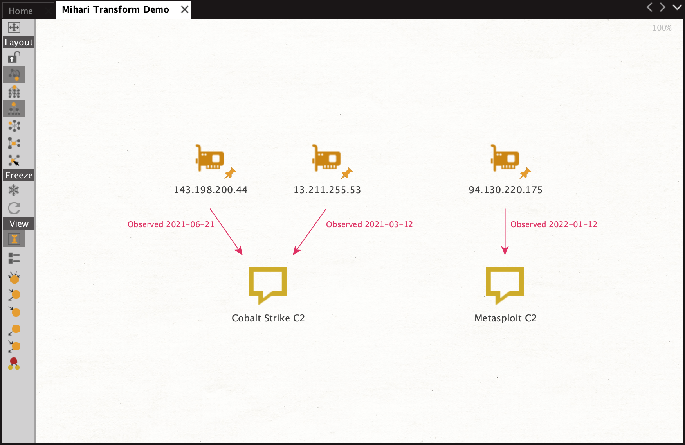

# Mihari Maltego Transform

The following Maltego Transform can be used to query a local [Mihari](https://github.com/ninoseki/mihari) sqlite3 database, and returns the detection name (i.e., as stored within the `alerts.title` column) associated with an IPv4 address. The transform runs entirely locally and does not require internet connectivity, and can be trivially updated to return other entity data by changing the SQL query within `IPToC2.py`. 

## Installation
1. `git clone` this directory
2. `pip install maltego-trx` (may require `sudo` dependant on `site-packages` permissions)
3. Edit `IPToC2.py` with the absolute path to your `mihari.db`

## Maltego Transform Configuration
1. Go to _Transforms_ -> _New Local Transform..._
2. On the _Local Transform Wizard_ prompt, update as follows:
    * __Display Name__: `Mihari IP to C2`
    * __Description__: `Returns the detection name(s) associated with an IPv4 address`
    * __Transform ID__: `snkhan.mihari_IPtoC2`
    * __Input entity type__: `IPv4 Address`
3. On the subsequent _Command Line_ prompt, update as follows:
    * __Command__: Absolute path to python3, use the output of `which python3`
    * __Parameters__: `project.py local IPToC2`
    * __Working Directory__: Set to (this) cloned directory

## Usage
1. Select one or multiple IPv4 addresses, or add one to the investigation via the _Entity Palette_.
2. Right-click to summon the _Run Transform_ dialogue, then select _Local Transforms_ -> _Mihari IP to C2_.
3. The _Transform Output_ pane will show the status of the query, and a new _Phrase_ entity type will be added to the investigation, together with an _Observed Date_ annotation, if a match is found.

__Note__: Maltego _does not_ add seperate _Phrase_ entities with the same detection name but multiple `created_at` values. The SQL query has been written such that it will always return the most recent observation date of a detection rule, in the event that multiple observations of the _same_ `alerts.title` exist.

---

I'd love to hear your thoughts and feedback. Feel free to say hello on Twitter [@snkhan](https://twitter.com/snkhan?lang=en) or via [LinkedIn](https://uk.linkedin.com/in/sajidnawazkhan).

---

#cti #threatintelligence #threathunting #infrastructurehunting #mihari #maltego #linkanalysis
